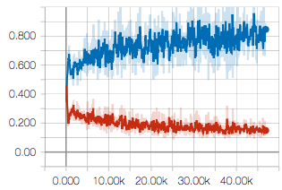

# GAN Experiments

Experiments with different GAN models.

## List of GAN
- GAN
- LSGAN
- WGAN
- WGAN-GP
- CycleGAN
- infoGAN

## Results

*Name* | *Epoch 1* | *Epoch 2* | *Epoch 3* | *Epoch 37* | *Epoch 50*
:---: | :---: | :---: | :---: | :---: | :---: |
GAN |  | | |  | 
LSGAN |  | | |  | 
WGAN |  | | |  | 
WGAN-GP |  | | |  | 

*Name* | *Loss* | *Legend*
:---: | :---: | :---: |
GAN |  | Dis(red), Gen(blue)
LSGAN|  | Dis(red), Gen(blue)
WGAN|  | Dis(blue), Gen(orange)
WGAN-GP|  | Dis(blue), Gen(orange)
## TODO
- [x] WGAN-GP
- [ ] CycleGAN
- [ ] infoGAN

